# Notification System Documentation

## Overview

MoneyMap implements a comprehensive local notification system for bill reminders using Expo's notification APIs. The system uses a **hybrid approach** with three scheduling mechanisms to ensure maximum reliability, even when the app hasn't been opened in days.

## Table of Contents

1. [Architecture Overview](#architecture-overview)
2. [Key Features](#key-features)
3. [System Components](#system-components)
4. [Data Flow](#data-flow)
5. [Scheduling Strategy](#scheduling-strategy)
6. [Database Schema](#database-schema)
7. [Configuration](#configuration)
8. [Testing](#testing)
9. [Troubleshooting](#troubleshooting)

---

## Architecture Overview

### High-Level Architecture

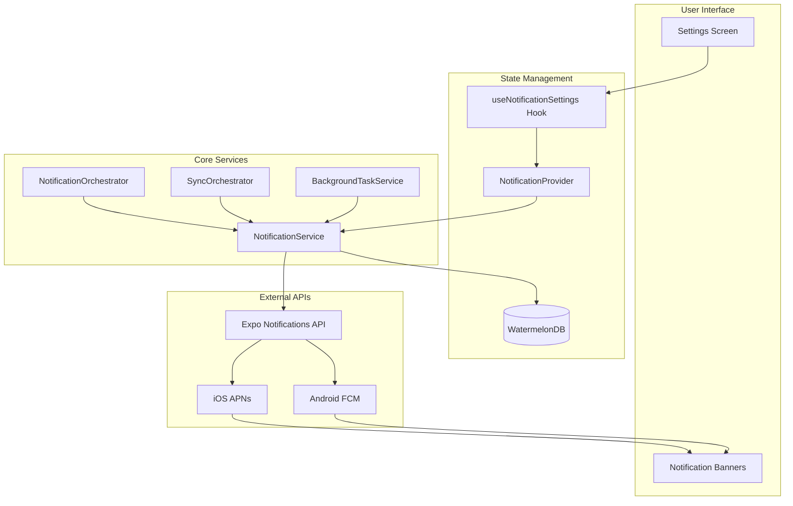

### Component Layers

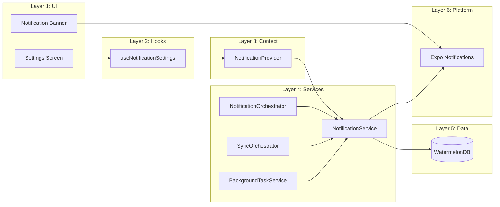

---

## Key Features

### ✅ Implemented Features

- **Local Bill Reminders**
  - Notifications on due date
  - Notifications 1 day before due date
  - User-configurable notification time (e.g., 9:00 AM)
  - Skip auto-pay bills automatically

- **Hybrid Scheduling Strategy**
  - Background sync scheduling (OS-scheduled, 60+ min intervals)
  - Foreground sync scheduling (every 60 seconds when app active)
  - Real-time rescheduling on budget item changes

- **Graceful Degradation**
  - Works in dev mode without native modules (shows warning)
  - Silent failure if notification permissions denied
  - Automatic retry on app restart

- **14-Day Scheduling Window**
  - Balances reliability with iOS notification limits
  - Gives background tasks time to run before bills due

### 🔮 Future Enhancements

- **Silent Push Notifications** (Phase 4)
  - Server-triggered background sync
  - Push token registration ready

- **Additional Notification Types**
  - Overdue bill notifications
  - Budget overspending alerts
  - Weekly digest summaries

---

## System Components

### 1. NotificationService

**File:** [`services/notification-service.ts`](../services/notification-service.ts)

**Responsibilities:**
- Permission management (request, check status)
- Bill reminder scheduling (create, cancel, reschedule)
- Push notification registration (future)
- Notification handler setup

**Key Methods:**

```typescript
class NotificationService {
  // Permission Management
  async requestPermissions(): Promise<boolean>
  async getPermissionStatus(): Promise<'granted' | 'denied' | 'undetermined'>

  // Bill Reminder Scheduling
  async scheduleBillReminders(budgetItem: BudgetItem, settings: NotificationSettings): Promise<string[]>
  async cancelBillReminders(budgetItem: BudgetItem): Promise<void>
  async rescheduleAllBillReminders(): Promise<void>

  // Push Notifications (Future)
  async registerForPushNotifications(): Promise<string | null>

  // Setup
  setupNotificationHandlers(): void
}
```

**Scheduling Logic:**

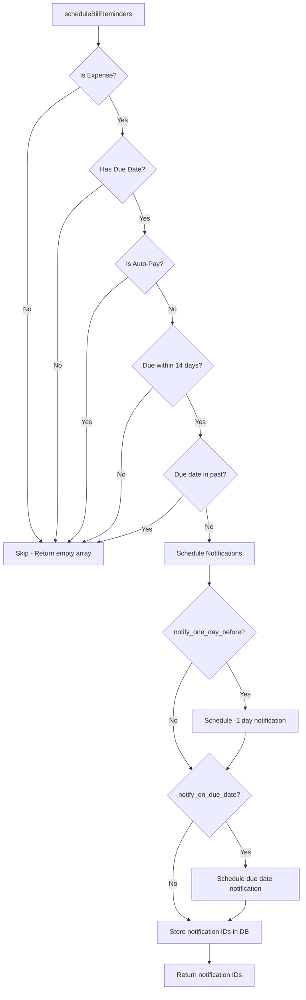

### 2. NotificationOrchestrator

**File:** [`services/notification-orchestrator.ts`](../services/notification-orchestrator.ts)

**Responsibilities:**
- Watch for budget item changes (due date, auto-pay status)
- Automatically reschedule notifications when changes detected
- Real-time notification updates

**Observable Pattern:**

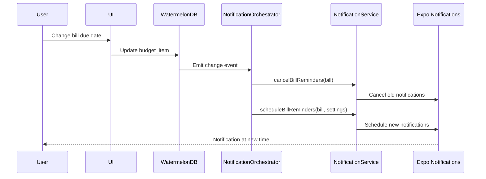

### 3. SyncOrchestrator Integration

**File:** [`services/sync-orchestrator.ts`](../services/sync-orchestrator.ts)

**Integration Point:** After foreground sync completes

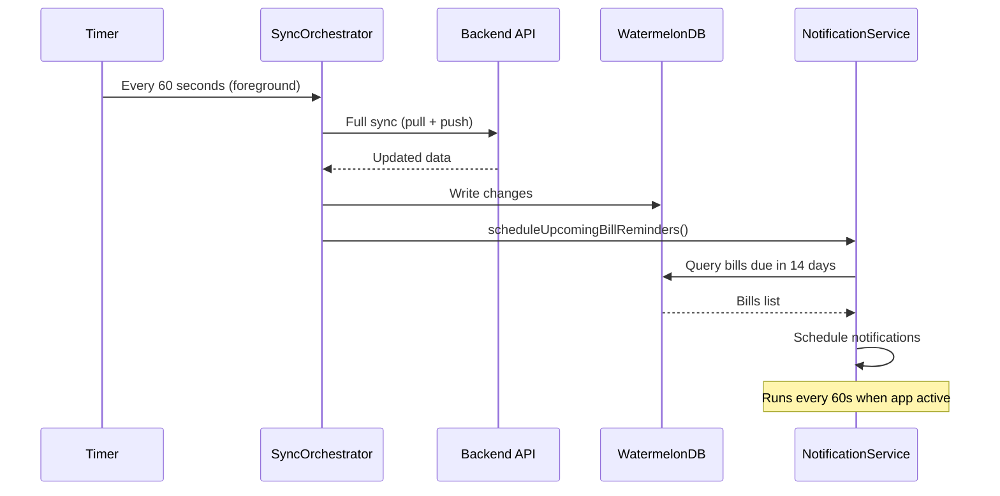

### 4. BackgroundTaskService Integration

**File:** [`services/background-task-service.ts`](../services/background-task-service.ts)

**Integration Point:** After background sync completes

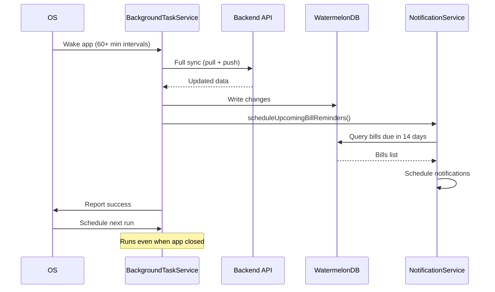

---

## Data Flow

### Complete Notification Lifecycle

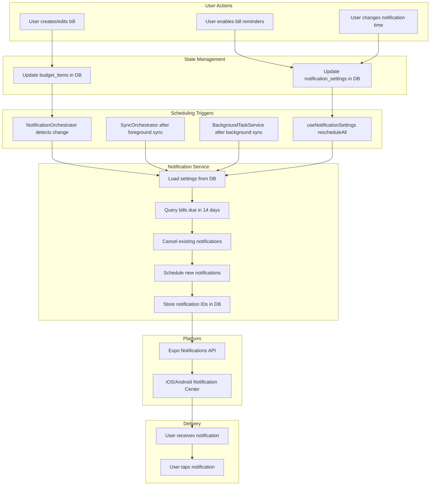

### Scheduling Decision Tree

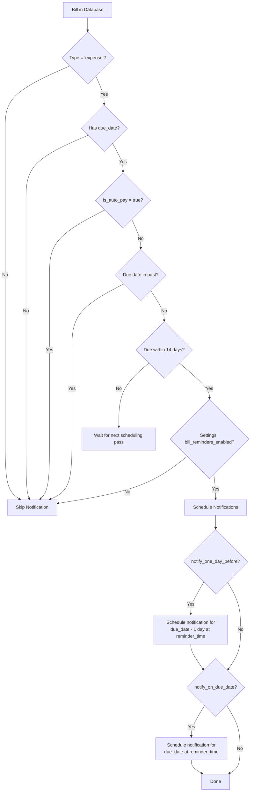

---

## Scheduling Strategy

### Hybrid Approach (3 Mechanisms)

The system uses **three independent scheduling mechanisms** to ensure maximum reliability:

#### 1. Background Sync Scheduling

**When:** OS-scheduled background task runs (60+ minute intervals)
**Reliability:** High - runs even when app is closed
**Trade-off:** Timing controlled by iOS/Android (not guaranteed)

```mermaid
gantt
    title Background Sync Scheduling
    dateFormat HH:mm
    axisFormat %H:%M

    section iOS Background Task
    Background sync runs :milestone, m1, 09:00, 0min
    Schedule bills :active, a1, 09:00, 2min

    Background sync runs :milestone, m2, 10:15, 0min
    Schedule bills :active, a2, 10:15, 2min

    Background sync runs :milestone, m3, 11:45, 0min
    Schedule bills :active, a3, 11:45, 2min
```

**Code Location:**
```typescript
// services/background-task-service.ts
private static async executeBackgroundSync() {
  // ... sync code ...
  await this.scheduleUpcomingBillReminders(); // ← Added here
}
```

#### 2. Foreground Sync Scheduling

**When:** Every 60 seconds while app is active
**Reliability:** Very high - guaranteed to run when app open
**Trade-off:** Only works when user has app open

```mermaid
gantt
    title Foreground Sync Scheduling
    dateFormat HH:mm
    axisFormat %H:%M

    section App Active
    User opens app :milestone, m1, 14:00, 0min
    Sync & schedule :active, a1, 14:00, 2min
    Sync & schedule :active, a2, 14:01, 2min
    Sync & schedule :active, a3, 14:02, 2min
    Sync & schedule :active, a4, 14:03, 2min
    User closes app :milestone, m2, 14:04, 0min
```

**Code Location:**
```typescript
// services/sync-orchestrator.ts
async executeForegroundFullSync() {
  // ... sync code ...
  await this.scheduleUpcomingBillReminders(); // ← Added here
}
```

#### 3. Real-Time Change Detection

**When:** User modifies a bill's due date or auto-pay status
**Reliability:** Immediate - zero delay
**Trade-off:** Only handles user-initiated changes

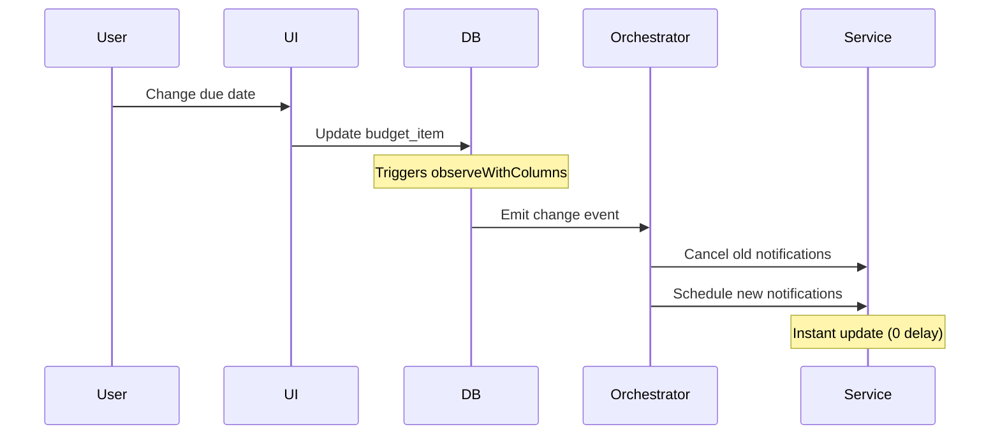

**Code Location:**
```typescript
// services/notification-orchestrator.ts
database.get('budget_items')
  .query(Q.where('type', 'expense'), Q.where('due_date', Q.notEq(null)))
  .observeWithColumns(['due_date', 'is_auto_pay']) // ← Watches these columns
  .subscribe(bills => this.handleBudgetItemsChanged(bills));
```

### 14-Day Scheduling Window

**Why 14 days?**
- Gives background tasks more time to run before bills due
- Still well under iOS's 64 scheduled notification limit
- Balances reliability with system constraints

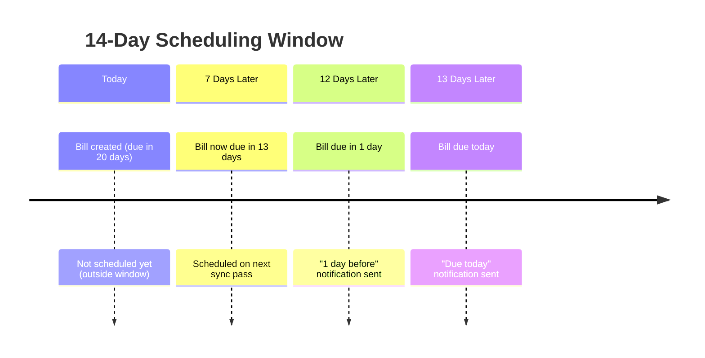

---

## Database Schema

### notification_settings Table

**Schema Version:** 18

```sql
CREATE TABLE notification_settings (
  id TEXT PRIMARY KEY,
  bill_reminders_enabled BOOLEAN NOT NULL DEFAULT 0,
  reminder_time_hour INTEGER NOT NULL DEFAULT 9,      -- 0-23
  reminder_time_minute INTEGER NOT NULL DEFAULT 0,    -- 0-59
  notify_on_due_date BOOLEAN NOT NULL DEFAULT 1,
  notify_one_day_before BOOLEAN NOT NULL DEFAULT 1,
  push_token TEXT,                                    -- For future push notifications
  created_at INTEGER NOT NULL,
  updated_at INTEGER NOT NULL
);
```

**Model:** [`model/models/notification-settings.ts`](../model/models/notification-settings.ts)

**Sync Status:** ✅ Synced to backend (user preferences across devices)

### budget_item_notifications Table

**Purpose:** Store scheduled notification IDs per budget item.

```sql
CREATE TABLE budget_item_notifications (
  id TEXT PRIMARY KEY,
  budget_item_id TEXT NOT NULL,
  notification_id TEXT NOT NULL,
  created_at INTEGER NOT NULL,
  updated_at INTEGER NOT NULL
);
```

**Example Value:**
```json
{ "budget_item_id": "bill_123", "notification_id": "550e8400-e29b-41d4-a716-446655440000" }
```

**Sync Status:** ❌ NOT synced (device-specific notification IDs)

### Entity Relationship

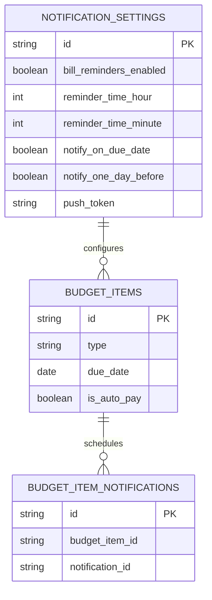

---

## Configuration

### app.json Configuration

```json
{
  "expo": {
    "notification": {
      "icon": "./assets/images/icon.png",
      "color": "#00A3E0",
      "androidMode": "default",
      "androidCollapsedTitle": "MoneyMap"
    },
    "ios": {
      "infoPlist": {
        "UIBackgroundModes": ["remote-notification"]
      }
    },
    "android": {
      "permissions": [
        "android.permission.RECEIVE_BOOT_COMPLETED",
        "android.permission.WAKE_LOCK",
        "android.permission.VIBRATE",
        "android.permission.POST_NOTIFICATIONS"
      ]
    },
    "plugins": [
      [
        "expo-notifications",
        {
          "icon": "./assets/images/icon.png",
          "color": "#ffffff",
          "mode": "production"
        }
      ]
    ]
  }
}
```

### Notification Channels (Android)

```typescript
// Automatically created by NotificationService
await Notifications.setNotificationChannelAsync('bill-reminders', {
  name: 'Bill Reminders',
  importance: Notifications.AndroidImportance.HIGH,
  vibrationPattern: [0, 250, 250, 250],
  lightColor: '#00A3E0',
});
```

### Default Settings

```typescript
const DEFAULT_SETTINGS = {
  billRemindersEnabled: false,        // Must opt-in
  reminderTimeHour: 9,                // 9 AM
  reminderTimeMinute: 0,              // :00
  notifyOnDueDate: true,              // Enabled by default
  notifyOneDayBefore: true,           // Enabled by default
};
```

---

## Testing

### Manual Testing Checklist

#### 1. Permission Flow
- [ ] Enable bill reminders → App requests permissions
- [ ] Deny permissions → Shows error/instructions
- [ ] Grant permissions → Enables successfully
- [ ] Already granted → No duplicate requests

#### 2. Notification Scheduling
- [ ] Create bill due tomorrow → Check logs for "Scheduled 2 notifications"
- [ ] Create bill due today → Check logs for "Scheduled 1 notification"
- [ ] Create bill due in 20 days → Check logs (should NOT schedule yet)
- [ ] Create auto-pay bill → Check logs (should skip)

#### 3. Real-Time Updates
- [ ] Change bill due date → Check logs for "Rescheduling"
- [ ] Toggle auto-pay ON → Check logs for cancellation
- [ ] Toggle auto-pay OFF → Check logs for scheduling
- [ ] Delete bill → Check logs for cancellation

#### 4. Settings Changes
- [ ] Change reminder time → Check logs for "Rescheduled all bill reminders"
- [ ] Disable "On due date" → Check only 1 notification scheduled per bill
- [ ] Disable "1 day before" → Check only 1 notification scheduled per bill
- [ ] Disable bill reminders → Check logs for "Cancelled all notifications"

#### 5. Sync Integration
- [ ] Open app → Check logs for foreground sync scheduling
- [ ] Wait 60 seconds → Check logs for next foreground sync scheduling
- [ ] Close app → Wait for background task → Check logs

#### 6. Platform Testing
- [ ] **iOS:** Notifications appear in Notification Center
- [ ] **iOS:** Notification sound plays
- [ ] **iOS:** Notifications persist after app closed
- [ ] **Android:** Notifications appear with proper icon/color
- [ ] **Android:** Notification channel settings work
- [ ] **Android:** Notifications survive app force-close

### Log Messages to Look For

```typescript
// Successful scheduling
"Scheduled notifications for 3/5 bills"

// Real-time rescheduling
"Cancelled bill reminders" → "Scheduled bill reminders"

// Settings changes
"Rescheduled all bill reminders" → "Scheduled notifications for X bills"

// Background sync
"Background sync task completed" → "Scheduled notifications for X bills"

// Graceful degradation
"Notifications not available, skipping NotificationOrchestrator"
```

### Testing Notifications Without Waiting

To test notifications immediately (without waiting for actual due dates):

1. **Modify `shouldScheduleNotification()` temporarily:**

```typescript
// services/notification-service.ts
private shouldScheduleNotification(budgetItem: BudgetItem): boolean {
  // Comment out date checks for testing
  return budgetItem.type === 'expense' &&
         budgetItem.dueDate &&
         !budgetItem.isAutoPay;
}
```

2. **Set notification date to +5 seconds:**

```typescript
// services/notification-service.ts
private calculateNotificationDate(...) {
  return dayjs().add(5, 'seconds').toDate(); // Test in 5 seconds
}
```

3. **Check iOS Notification Center** (Simulator):
   - Hardware → Touch ID → Enrolled
   - Run app, create bill
   - Wait 5 seconds
   - Swipe down from top to see notification

---

## Troubleshooting

### Common Issues

#### 1. Notifications Not Appearing

**Symptoms:** No notifications received despite settings enabled

**Checks:**
```typescript
// 1. Check permission status
const status = await notificationService.getPermissionStatus();
console.log('Permission status:', status); // Should be 'granted'

// 2. Check settings
const settings = await database.get('notification_settings').query().fetch();
console.log('Bill reminders enabled:', settings[0]?.billRemindersEnabled);

// 3. Check scheduled notifications
const notifications = await database.get('budget_item_notifications').query().fetch();
console.log('Scheduled notification records:', notifications.length);

// 4. Check Expo's scheduled notifications
const scheduled = await Notifications.getAllScheduledNotificationsAsync();
console.log('Expo scheduled notifications:', scheduled.length);
```

**Solutions:**
- Permissions denied → Go to iOS Settings → MoneyMap → Notifications → Enable
- Settings disabled → Enable in app Settings → Notifications
- No bills scheduled → Check due dates (must be within 14 days)
- Expo shows 0 scheduled → Check logs for errors during scheduling

#### 2. Duplicate Notifications

**Symptoms:** Multiple notifications for the same bill

**Cause:** Multiple scheduling passes without cancellation

**Solution:**
```typescript
// Check if bill has multiple notification IDs
const bill = await database.get('budget_items').find(id);
const records = await database
  .get('budget_item_notifications')
  .query(Q.where('budget_item_id', bill.id))
  .fetch();
console.log(
  'Notification IDs:',
  records.map(record => record.notificationId)
); // Should be 1-2 max

// Cancel and reschedule
await notificationService.cancelBillReminders(bill);
await notificationService.scheduleBillReminders(bill, settings);
```

#### 3. Notifications Not Rescheduling on Due Date Change

**Symptoms:** Old notification time still fires after changing due date

**Checks:**
```typescript
// 1. Check if NotificationOrchestrator is running
const status = notificationOrchestrator.getStatus();
console.log('Orchestrator status:', status); // running: true, available: true

// 2. Check if observeWithColumns is working
// Add temporary log in notification-orchestrator.ts:
.subscribe({
  next: async bills => {
    console.log('Budget items changed:', bills.length);
    await this.handleBudgetItemsChanged(bills);
  }
});
```

**Solutions:**
- Orchestrator not running → Restart app (should auto-start)
- Orchestrator not available → Run `npm run ios` to build native modules
- No logs on change → Check WatermelonDB subscription

#### 4. Background Sync Not Scheduling

**Symptoms:** Notifications only schedule when app is open

**Checks:**
```typescript
// 1. Check background task registration
const status = await backgroundTaskService.getTaskStatus();
console.log('Background task registered:', status.registered);
console.log('Last sync:', status.lastSyncTime);

// 2. Check iOS background fetch capability
// In Xcode: Capabilities → Background Modes → Background fetch (enabled)

// 3. Check logs for background sync
// Look for: "Background sync task triggered by OS"
```

**Solutions:**
- Task not registered → Check app.json has `expo-background-task` plugin
- iOS not triggering → Put on charger + WiFi, iOS learns usage patterns over time
- No logs → Background task may not be running (iOS controlled)

#### 5. Native Module Not Available (Dev Mode)

**Symptoms:** Warning: "expo-notifications native module not available"

**Expected Behavior:** This is normal in dev mode

**Solution:** Run `npm run ios` to build with native modules

**Workaround:** Settings screen shows warning banner, notifications disabled

```typescript
// Check availability
const { isAvailable } = useNotificationContext();
console.log('Notifications available:', isAvailable); // false in dev mode
```

### Debug Mode

To enable verbose notification logging:

```typescript
// services/notification-service.ts
// Add at the top of each method:
logger.info('Method called', { type: LogType.General, params: { ... } });

// Example:
async scheduleBillReminders(budgetItem: BudgetItem, settings: NotificationSettings) {
  logger.info('scheduleBillReminders called', {
    type: LogType.General,
    budgetItemId: budgetItem.id,
    dueDate: budgetItem.dueDate,
    isAutoPay: budgetItem.isAutoPay
  });
  // ... rest of method
}
```

View logs in app: Settings → Developer → View Logs → Filter by "General" type

---

## Platform-Specific Considerations

### iOS

**Background Execution Limits:**
- Background fetch runs at OS discretion (60+ min minimum)
- iOS learns app usage patterns over time
- More frequent when device is charging + WiFi
- Can be delayed/skipped for battery preservation

**Notification Limits:**
- Maximum 64 scheduled local notifications
- Our 14-day window typically schedules 10-30 notifications
- Old notifications automatically removed when new ones scheduled

**Testing Background Fetch:**
```bash
# Trigger background fetch in simulator
xcrun simctl spawn booted notify_post com.apple.notifyd.scheduled-delivery
```

### Android

**Background Execution:**
- More predictable than iOS
- WorkManager respects system constraints
- Battery optimization may delay notifications

**Notification Channels:**
- Required for Android 8.0+ (API 26)
- Users can customize per-channel settings
- Channel: "Bill Reminders" (HIGH importance)

**Exact Alarms (Android 12+):**
- May need `SCHEDULE_EXACT_ALARM` permission for precise timing
- Currently using inexact scheduling (acceptable for bill reminders)

---

## Performance Considerations

### Scheduling Performance

**Current Implementation:**
- Queries: ~50ms (bills due in 14 days)
- Scheduling: ~10ms per notification
- Total: <500ms for typical user (20-30 bills)

**Optimization Opportunities:**
- Batch notification scheduling (not currently needed)
- Index on `due_date` column (already indexed via `isIndexed: true`)
- Debounce real-time orchestrator (not needed, instant is better UX)

### Memory Usage

**Minimal Impact:**
- NotificationOrchestrator: <1KB (just subscription)
- NotificationService: <5KB (stateless, per-call instantiation)
- Scheduled notifications: iOS/Android managed (not in app memory)

### Battery Impact

**Low Impact:**
- Background sync: OS-scheduled (no polling)
- Foreground sync: Only when app active
- Real-time orchestrator: WatermelonDB subscription (very efficient)
- No continuous timers or location services

---

## Future Enhancements

### Phase 3: Notification Interactions

```typescript
// Handle notification tap
Notifications.addNotificationResponseReceivedListener(response => {
  const { budgetItemId } = response.notification.request.content.data;

  // Navigate to recurring screen
  router.push({
    pathname: '/(auth)/(tabs)/recurring',
    params: { highlightItemId: budgetItemId }
  });
});
```

### Phase 4: Silent Push Notifications

**Backend Requirements:**
1. Store device push tokens
2. Create trigger endpoint
3. Send APNs/FCM silent push

**Client Implementation:**
```typescript
// Already registered push token in NotificationService
const token = await notificationService.registerForPushNotifications();

// Handler (in NotificationProvider)
Notifications.addNotificationReceivedListener(async (notification) => {
  if (notification.request.content.data.silentSync) {
    await syncOrchestrator.executeForegroundSync();
  }
});
```

**APNs Payload:**
```json
{
  "aps": {
    "content-available": 1
  },
  "data": {
    "silentSync": true
  }
}
```

### Phase 5: Additional Notification Types

**Overdue Bills:**
```typescript
// Run daily check
if (dayjs().diff(bill.dueDate, 'days') > 0 && !bill.isCompleted) {
  await scheduleNotification('Bill Overdue', `${bill.name} was due ${days} days ago`);
}
```

**Budget Overspending:**
```typescript
// Check after transaction sync
if (budgetItem.spendingPercentage > 100) {
  await scheduleNotification('Budget Alert', `You've exceeded your ${budgetItem.name} budget`);
}
```

**Weekly Digest:**
```typescript
// Schedule Sunday at 6 PM
await scheduleNotification(
  'Bills This Week',
  `You have ${upcomingBills.length} bills due this week totaling $${total}`
);
```

---

## References

### Key Files

- **Services:**
  - [`services/notification-service.ts`](../services/notification-service.ts) - Core notification logic
  - [`services/notification-orchestrator.ts`](../services/notification-orchestrator.ts) - Real-time change detection
  - [`services/sync-orchestrator.ts`](../services/sync-orchestrator.ts) - Foreground sync integration
  - [`services/background-task-service.ts`](../services/background-task-service.ts) - Background sync integration

- **Models:**
  - [`model/models/notification-settings.ts`](../model/models/notification-settings.ts) - Settings model
  - [`model/models/budget-item.ts`](../model/models/budget-item.ts) - Budget item with notification IDs

- **UI:**
  - [`app/(auth)/settings.tsx`](../app/(auth)/settings.tsx) - Settings screen with notification section
  - [`components/ui/inputs/time-picker.tsx`](../components/ui/inputs/time-picker.tsx) - Time picker component
  - [`components/ui/inputs/checkbox-input.tsx`](../components/ui/inputs/checkbox-input.tsx) - Checkbox component

- **Hooks:**
  - [`hooks/use-notification-settings.tsx`](../hooks/use-notification-settings.tsx) - Settings hook
  - [`hooks/use-background-tasks.tsx`](../hooks/use-background-tasks.tsx) - Background task initialization

- **Context:**
  - [`context/NotificationProvider.tsx`](../context/NotificationProvider.tsx) - App-level notification provider

### External Documentation

- [Expo Notifications](https://docs.expo.dev/versions/latest/sdk/notifications/)
- [Expo Background Fetch](https://docs.expo.dev/versions/latest/sdk/background-fetch/)
- [Expo Task Manager](https://docs.expo.dev/versions/latest/sdk/task-manager/)
- [WatermelonDB Observables](https://nozbe.github.io/WatermelonDB/Advanced/Observing.html)

---

## Changelog

### v1.0.0 (2026-01-10)

**Phase 1: Foundation**
- ✅ Database schema (notification_settings table, v18 migration)
- ✅ NotificationSettings model with computed properties
- ✅ NotificationService with permission management
- ✅ NotificationProvider with graceful degradation
- ✅ Settings UI with time picker and checkboxes
- ✅ useNotificationSettings hook

**Phase 2: Local Bill Reminders**
- ✅ 14-day scheduling window
- ✅ Background sync integration (background-task-service.ts)
- ✅ Foreground sync integration (sync-orchestrator.ts)
- ✅ Real-time change detection (notification-orchestrator.ts)
- ✅ Hybrid scheduling strategy (3 mechanisms)
- ✅ Comprehensive logging

**Future:**
- 🔮 Phase 3: Notification interactions (tap to navigate)
- 🔮 Phase 4: Silent push notifications
- 🔮 Phase 5: Additional notification types

---

## Support

For issues or questions about the notification system:

1. Check logs: Settings → Developer → View Logs
2. Verify settings: Settings → Notifications
3. Test with bills due tomorrow (easiest to verify)
4. Review this documentation
5. Check troubleshooting section above

**Common Log Patterns:**
```
✅ Good: "Scheduled notifications for 5/5 bills"
⚠️  Warning: "Bill reminders disabled, skipping notification scheduling"
❌ Error: "Failed to schedule bill reminders"
```
